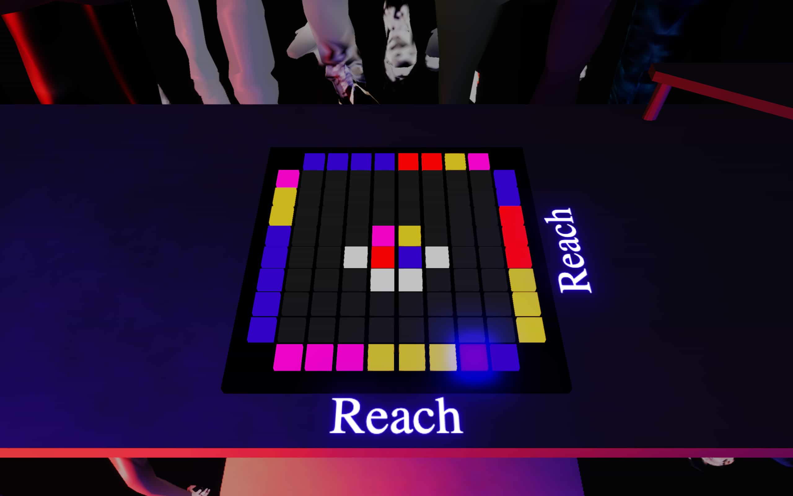
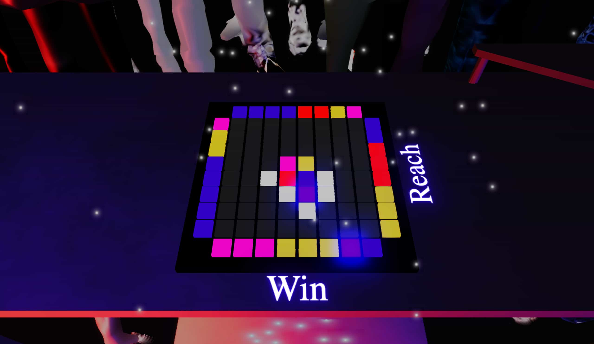

# @tsei/lapa

<a href="https://lapa.tsei.jp" target=”_blank” rel="noopener noreferrer">
  </img>
</a>

## The Game Overview

This game is an original board game inspired by beloved classics like Mahjong. The objective is simple yet engaging: among four players, the first one to collect three sets of three colored pairs wins.

このゲームは、麻雀のような人気のあるクラシックなゲームに触発されたオリジナルのボードゲームです。目標はシンプルでありながらも魅力的です:4人のプレイヤーの中で、最初に3つの色の組み合わせを3セット集めた人が勝利します。

## Gameplay & Mechanics

### Collecting Pairs

Players take turns choosing a tile from the 8x8 array in the center. Each player begins with eight tiles. You swap one of your tiles with the one you chose, revealing its color. The game ends when all tiles are revealed, or a player forms 3x3 color pairs in their hand.

プレイヤーは交互に中央の8x8の配列からタイルを選びます。各プレイヤーは8枚のタイルから始め、選んだタイルと自分のタイルを交換し、その色を明らかにします。ゲームは全てのタイルが明らかになった時、またはプレイヤーが手元で3x3の色のペアを形成した時に終了します。

<table>
<td>
</img>
</td>
<td>
</img>
</td>
</table>

### Restrictions & Strategy

There are rules on which tiles you can choose. One is that it must be adjacent to an already revealed tile. Furthermore, you can't swap for a tile adjacent to one the same color as a complete set you hold. Lastly, you can swap with a tile discarded by the previous player.

選べるタイルにはルールがあります。一つは、既に明らかになったタイルに隣接していなければならないということです。さらに、持っている完全なセットと同じ色のタイルに隣接するタイルとは交換できません。最後に、前のプレイヤーが捨てたタイルと交換することができます。

Balancing quick returns with the risk of enabling opponents to win forms the core strategy of the game. It incorporates the spirit of classic board games where players can impede each other's progress.

素早いリターンと対戦相手に勝つチャンスを与えるリスクをバランス良くとることが、ゲームの中核戦略を形成します。これは、プレイヤーが互いの進行を妨げるクラシックなボードゲームの精神を取り入れています。

<table>
<td>
</img>
</td>
<td>
</img>
</td>
</table>

## Visuals

Inspired by the event theme, Party, the visuals echo a DJ event with a boiler room format where many surround a single DJ set.

イベントテーマである「パーティー」に触発されたビジュアルは、DJイベントのボイラールーム形式を反映しており、多くの人々が一つのDJセットを囲むような形をしています。

## Inspiration & Uniqueness

The game's concept stems from the complexities of Mahjong. While preserving the interesting elements of the original game, this version eliminates the steep learning curve, making it fun and accessible, thus succeeding in its challenge of simplicity without losing depth.

ゲームのコンセプトは、麻雀の複雑さから生まれています。オリジナルのゲームの面白い要素を保ちつつ、このバージョンでは急な学習曲線を排除し、楽しくアクセス可能にしています。そのため、深みを失うことなくシンプルさへの挑戦に成功しています。

## Closing Thoughts

This game is a journey that starts with simple rules but ends with dynamic strategy and unexpected results. Be ready for a memorable party!

このゲームは、シンプルなルールから始まり、ダイナミックな戦略と予想外の結果で終わる旅です。思い出に残るパーティーの準備を！

